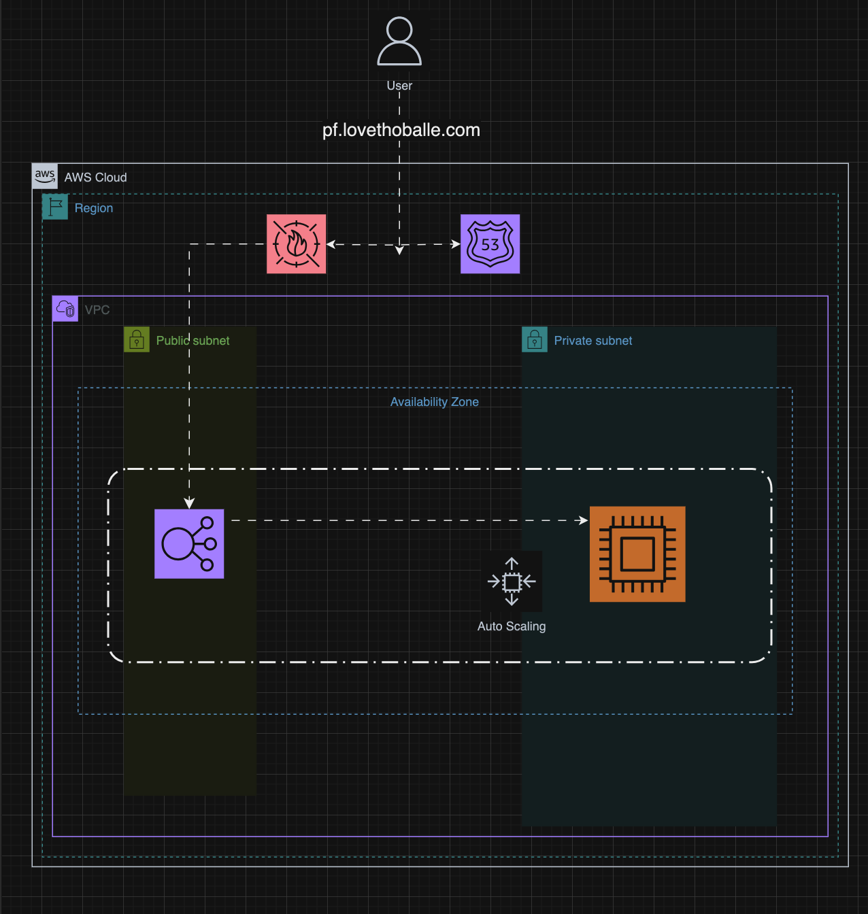
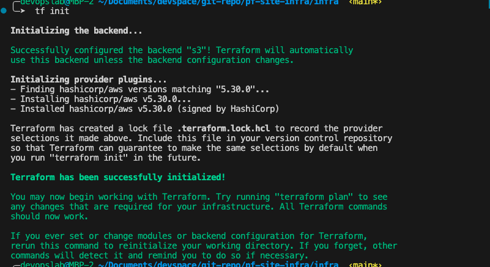
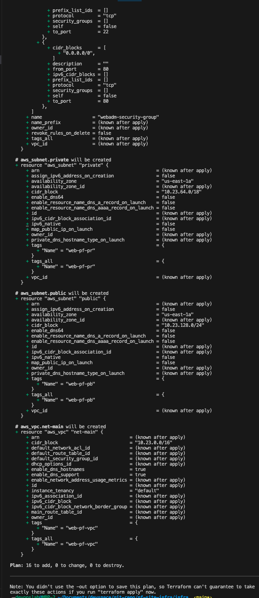

# Host my DevOps portfolio website on AWS

## Overview
The project involves setting up a highly available infrastructure on AWS to host a web application. Terraform will be used for infrastructure as code (IaC) to provision and manage the resources. Additionally, a monitoring solution will be implemented for tracking the health and performance of the infrastructure.

## Requirement
- AWS ACCOUNT (with access to EC2, S3 and CloudFront)
- TERRAFORM
- AWS CLI


## Architectural diagram



## Step 1: Create an AWS Account & Install Terraform & AWS CLI

Depending on your os  you can follow the corresponding guide for installing Terraform and AWS CLI.

For macOS users, use Homebrew package manager to install both tools by running these commands in terminal:
bash -c "$(curl -fsSL https://raw.githubusercontent.com/Homebrew/install/HEAD/install.sh)"

`brew install terraform awscli`

For  Windows users, download and install from [here](https://www.terraform.io/downloads) and [here](https://docs.aws.amazon.com/cli/latest/

## step 2:  Configure AWS CLI
Run `aws configure` command in terminal to set up your aws credentials. You will be prompted to enter Access Key ID, Secret Access Key, Default region name, and Default output format. 

### Output
 

Terraform uses thesame credentials to aythenticate so you don't have to provide the creds in your config.

## step 3:  Clone this repository into your local machine

```
   git clone https://github.com/insiible-techup/pf-site-infra.git
   cd infra
```

## Step 4:  Initialize Terraform

This will download any plugins required by the configuration files.

command:
`terraform init`

The initialization should look this;




## Step 5:  Plan out what infrastructure changes need to be made

This command generates a plan that describes all of the resources Terraform would create or modify.

command:
`terraform plan`

The output should look like something similar to below image. The important part is the `+` sign next to "aws_instance.example" which indicates it will be created. The output should look like this if everything is working correctly:



##  Step 6: Apply the Infrastructure Changes (if everything looks good from above)

If everything looks good from the `terraform plan` command then apply the changes with the following command:

Command:
`terraform apply`

You will be prompted for "yes" if you want to proceed, type yes and press enter
Once complete, check your AWS Management Console again to see the new EC2 instance has been created

##  Clean up  
To destroy the entire environment including the EC2 Instance just run the following 

command:
`terraform destroy`

